Run in Android Studio version 3.6.2
==========================================
I ran and tested all the samples in Android Studio 3.6.2.
I put Gif animation for each sample.
Do not update Android Gradle plugin.

Only *ContextMenuScrollingText* was an error:
"No toolchains found in the NDK toolchains folder for ABI with prefix: mips64el-linux-android"

To solve this problem:
- Download the previous NDK version(Android NDK, Revision 16b) from bellow link:
   https://developer.android.com/ndk/downloads/older_releases
- After unzipping that folder, copy mips64el-linux-android-4.9 and mipsel-linux-android-4.9 folders 
   to your local ndk-bundle toolchains directory like this example:
   Source: ..\Downloads\android-ndk-r16b-windows-x86_64\android-ndk-r16b\toolchains
   Destination: ..\\AppData\Local\Android\Sdk\ndk-bundle\toolchains

Android Developer Fundamentals (Version 2)
==========================================

This repository contains samples, starter code, and solutions for
Version 2 of the Android Developer Fundamentals course (August 2018).

Introduction
------------

Each of the samples in this repository is associated with a practical
exercise from the Android Developer Fundamentals course. While each
sample stands and runs on its own, they are designed to be used
together with the course.

The Android Developer Fundamentals course is an instructor-led
training experience and is targeted towards beginning Android
developers with a background in software development or computer
science.

Pre-requisites
--------------

The samples, along with the course, assume basic competence in software
design and development, as well as some background in computer science.

Specifically, to get started you need:

- Familiarity with the general software development process for object-oriented
applications using an IDE (Integrated Development Environment).
- At least 1-3 years of experience with object-oriented programming and
the Java programming language.

For the more advanced samples, it helps to know about:

- SQLite databases and the SQLite query language.
- Software architectural patterns that separate data from the user interface,
such as MVP, MVC, or MVA.
- Threading

You don't need to know anything about Android to get started.

Getting Started
---------------

1. [Install Android Studio](https://developer.android.com/studio/install.html),
if you don't already have it.
2. Download the sample.
2. Import the sample into Android Studio.
3. Build and run the sample.

Sample's Picture
---------------

### AppWithSettings

 > This app is based on the Basic Activity template and provides an options menu
 > with the Settings option. The user clicks Settings to show the Settings
 > activity and to change the setting. The app shows a Toast message showing the
 > value of the setting.

### ContextMenuScrollingText

 > This app displays a scrollable TextView (a magazine article).
 > It includes a context menu with choices for acting on
 > the article (Edit, Share, Delete).

### DialogForAlert

 > This app shows a button to trigger a standard alert dialog.

 

 ### DroidCafe
- DroidCafeChallenge
- DroidCafeInput
- DroidCafeOptions
- DroidCafeOptionsUp
- DroidCafeWithSettings
- DroidCafeWithSettingsChallenge

 > This app demonstrates images used as buttons and a floating action button for
 > an intent to launch a second activity. The app lets a user tap an image to
 > make a choice. The app displays a Toast showing the user’s choice, and sends
 > the choice as data with an intent to launch the second activity. This version
 > includes options in the options menu, in which some of the options appear as
 > icons in the app bar, and also includes the Up button.

 

### HelloCompat

 > This app demonstrates the use of the ContextCompat class, part of the
 > V4 support library.

### HelloSharedPrefs

 > HelloSharedPrefs is an adaptation of the HelloToast app from chapter 1.
 > It includes:
 > - Buttons for changing the background color.
 > - Maintenance of instance state.
 > - Themes and styles.
 > - Read and write shared preferences for the current count and the color.
 >
 > This is the solution code for HelloSharedPrefs.

### HelloToastChallenge2
- HelloToast
- HelloToastChallenge

 > Displays two Buttons and a TextView.
 > - Pressing the TOAST button shows a Toast.
 > - Pressing the COUNT button increases the displayed mCount.

### ImplicitIntents
- ImplicitIntentsReceiver

 > The ImplicitIntents app contains three buttons for sending implicit intents:
 > - Open a URL in a browser
 > - Find a location on a map
 > - Share a text string

### KeyboardDialPhone

 > This app accepts a phone number and sends implicit intent to dial the number.

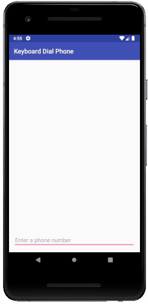

### MaterialMe
- MaterialMe-Resource

 > Main Activity for the Material Me app, a mock sports news application.

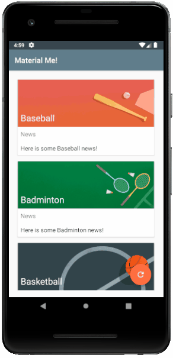

### NavDrawerExperiment

 > This app sets up a navigation drawer with the following choices: Import, Gallery,
 > Slideshow, Tools, Share, and Send. Choosing any choice closes the navigation drawer
 > and displays a toast message showing which choice was selected.
 > This app was created using the Navigation Drawer Activity template.

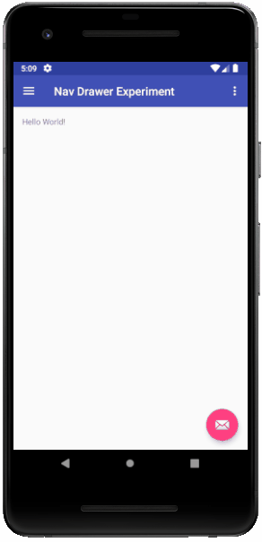

### NotificationScheduler

 > The Service that JobScheduler runs once the conditions are met.
 > In this case it posts a notification.

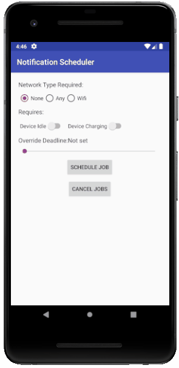

### NotifyMe

 > MainActivity for the Notify Me! app. Contains three buttons that deliver,
 > update, and cancel notification.

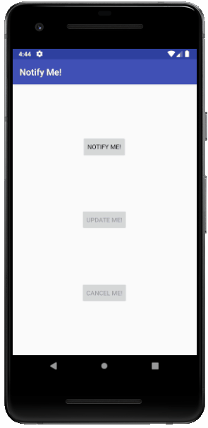

### PhoneNumberSpinnerEspresso

 > This app shows a spinner right next to a phone number field. The spinner lets
 > the user choose the type of phone number: Home, Work, Mobile, and Other.

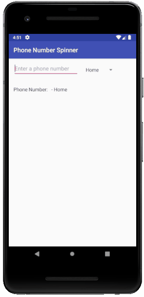

### PickerForDate

 > App based on Empty Activity template that shows date picker when the user taps the button for Date.
 > This app shows the date picker. The user taps Date to set the date in the date picker, and after changing the date and clicking OK, the main screen shows a Toast message with the date.

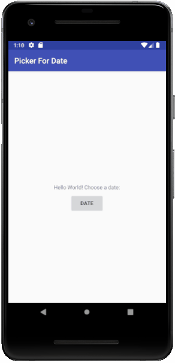

### PickerForTime

 > App based on Empty Activity template that shows a time picker when the user taps the button for Time.

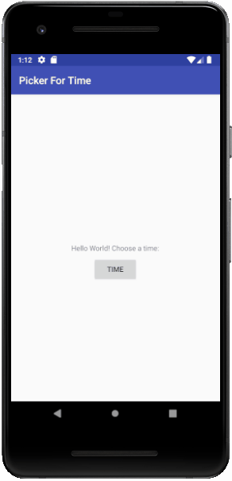

### PowerReceiver

 > The PowerReceiver app uses a Broadcast Receiver to receive the system Broadcast Intent delivered when the device is connected and disconnected from power and displays a Toast message. It also delivers a custom Broadcast Intent and responds with another Toast message when the custom Broadcast is received.

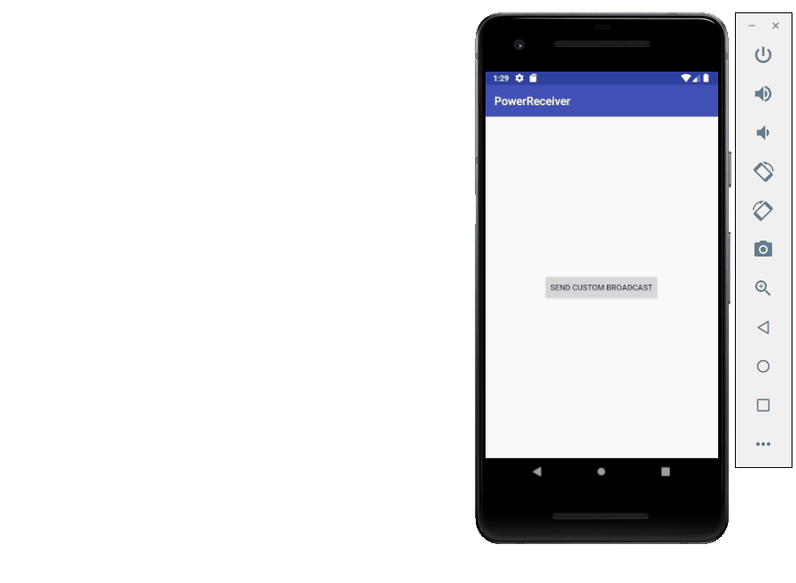

### RecyclerView
- RecyclerViewEspresso

 > Uses a RecyclerView to display data. Implements a custom adapter for the RecyclerView.
 > This sample shows how to use a RecyclerView to display data using a custom adapter to manage the data and the views.

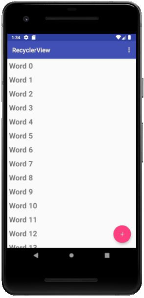

### RoomWordsSample
- RoomWordsWithDelete
- RoomWordsWithUpdate

 > This repository contains the finished sample code for the Architecture Components practical.
 > In May 2017 Google released the Architecture Components libraries. Each library manages and simplifies aspects of data persistence and the UI component lifecycle. Together, the libraries encourage a modular app architecture that results in reduced complexity and less code.
 > This sample shows how to use the libraries to build a complete basic app that implements the recommended architecture and can be used as a template for further explorations.

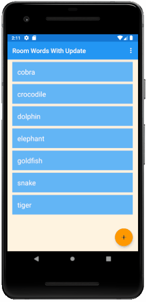

### Scorekeeper
- ScorekeeperEspresso

 > The Scorekeeper app keeps score for any game involving two teams. The user can increment or decrement the score for each team using simple Button views.

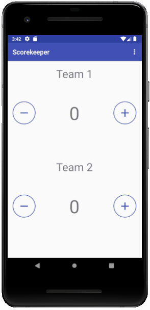

### ScrollingText
- ScrollingTextChallenge

 > The Scrolling Text app demonstrates the ScrollView UI component.
 > The app shows how to use a ScrollView to display text. The user can scroll vertically to read by swiping up and down. The app shows how you can use text formatted with minimal HTML tags for setting text to bold or italic, and with new-line characters to separate paragraphs. You can also include active web links in the text.

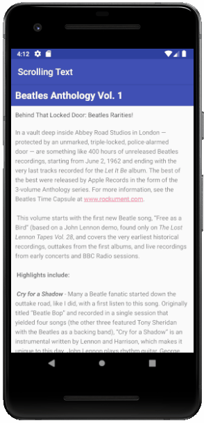

### SimpleAsyncTask

 > The SimpleAsyncTask app uses an AsyncTask that simulates doing work on a background thread by putting that thread to sleep for a random amount of time, and then displaying that time in the UI.

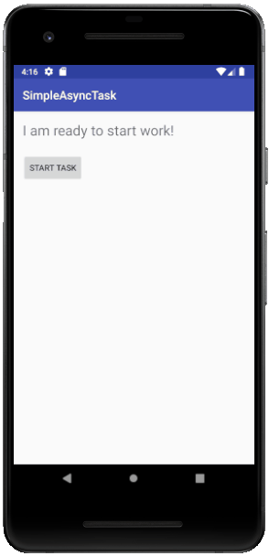

### SimpleCalcTest

 > SimpleCalcTests is a modification of SimpleCalc that uses unit tests to reveal potential issues.

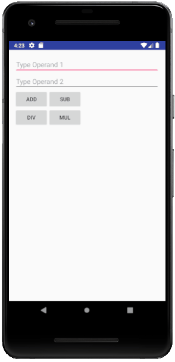

### StandUp

 > The Stand Up! Application uses the AlarmManager to schedule an inexact repeating alarm that delivers a notification to remind the user to stand up, approximately every fifteen minutes.

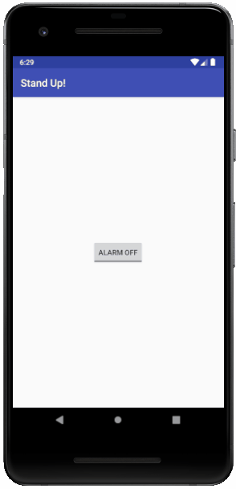

### TabExperiment

 > App that demonstrates how to build navigation with tabs and swipe views.
 > This app created from the Empty Activity template shows tabs for navigation and displays different content (different fragments) for each tab.

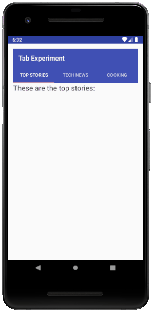

### TransitionsandAnimations 

 > The Transitions and Animations app has 4 objects arranged in a grid. Each object launches a transition or animation when it is clicked. The animations are as follows: An explode animation, a fade animation, a rotation animation, and a shared element transition.

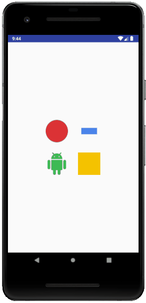

### TwoActivities
- TwoActivitiesEspresso
- TwoActivitiesLifecycle

 > The TwoActivities app contains two activities. It uses an explicit Intent to launch one Activity from another, and uses Intent extras to pass data between them.

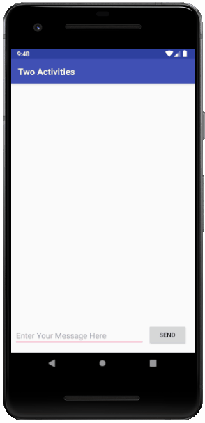

### WhoWroteIt
- WhoWroteItLoader

 > The WhoWroteIt? app uses an AsyncTask to query the Google Books API and display the result in a TextView.

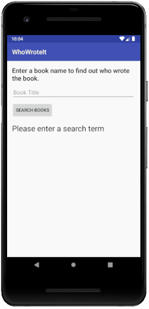

License
-------

Copyright 2018 Google, Inc.

Licensed to the Apache Software Foundation (ASF) under one or more contributor
license agreements.  See the NOTICE file distributed with this work for
additional information regarding copyright ownership.  The ASF licenses this
file to you under the Apache License, Version 2.0 (the "License"); you may not
use this file except in compliance with the License.  You may obtain a copy of
the License at

  http://www.apache.org/licenses/LICENSE-2.0

Unless required by applicable law or agreed to in writing, software
distributed under the License is distributed on an "AS IS" BASIS, WITHOUT
WARRANTIES OR CONDITIONS OF ANY KIND, either express or implied.  See the
License for the specific language governing permissions and limitations under
the License.
