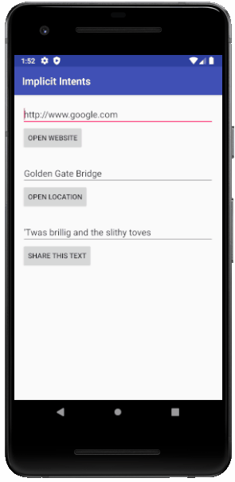

Android Developer Fundamentals (Version 2)
==========================================

This repository contains samples, starter code, and solutions for
Version 2 of the Android Developer Fundamentals course (August 2018).

Introduction
------------

Each of the samples in this repository is associated with a practical
exercise from the Android Developer Fundamentals course. While each
sample stands and runs on its own, they are designed to be used
together with the course.

The Android Developer Fundamentals course is an instructor-led
training experience and is targeted towards beginning Android
developers with a background in software development or computer
science.

Pre-requisites
--------------

The samples, along with the course, assume basic competence in software
design and development, as well as some background in computer science.

Specifically, to get started you need:

- Familiarity with the general software development process for object-oriented
applications using an IDE (Integrated Development Environment).
- At least 1-3 years of experience with object-oriented programming and
the Java programming language.

For the more advanced samples, it helps to know about:

- SQLite databases and the SQLite query language.
- Software architectural patterns that separate data from the user interface,
such as MVP, MVC, or MVA.
- Threading

You don't need to know anything about Android to get started.

Getting Started
---------------

1. [Install Android Studio](https://developer.android.com/studio/install.html),
if you don't already have it.
2. Download the sample.
2. Import the sample into Android Studio.
3. Build and run the sample.

Sample's Picture
---------------

### AppWithSettings

 > This app is based on the Basic Activity template and provides an options menu
 > with the Settings option. The user clicks Settings to show the Settings
 > activity and to change the setting. The app shows a Toast message showing the
 > value of the setting.

### ContextMenuScrollingText

 > This app displays a scrollable TextView (a magazine article).
 > It includes a context menu with choices for acting on
 > the article (Edit, Share, Delete).

DialogForAlert

 > This app shows a button to trigger a standard alert dialog.

 

 ### DroidCafe
	- DroidCafeChallenge
	- DroidCafeInput
	- DroidCafeOptions
	- DroidCafeOptionsUp
	- DroidCafeWithSettings
	- DroidCafeWithSettingsChallenge

 > This app demonstrates images used as buttons and a floating action button for
 > an intent to launch a second activity. The app lets a user tap an image to
 > make a choice. The app displays a Toast showing the user’s choice, and sends
 > the choice as data with an intent to launch the second activity. This version
 > includes options in the options menu, in which some of the options appear as
 > icons in the app bar, and also includes the Up button.

 

### HelloCompat

 > This app demonstrates the use of the ContextCompat class, part of the
 > V4 support library.

### HelloSharedPrefs

 > HelloSharedPrefs is an adaptation of the HelloToast app from chapter 1.
 > It includes:
 > - Buttons for changing the background color.
 > - Maintenance of instance state.
 > - Themes and styles.
 > - Read and write shared preferences for the current count and the color.
 >
 > This is the solution code for HelloSharedPrefs.

### HelloToastChallenge2
	- HelloToast
	- HelloToastChallenge

 > Displays two Buttons and a TextView.
 > - Pressing the TOAST button shows a Toast.
 > - Pressing the COUNT button increases the displayed mCount.

### ImplicitIntents
	- ImplicitIntentsReceiver

 > The ImplicitIntents app contains three buttons for sending implicit intents:
 > - Open a URL in a browser
 > - Find a location on a map
 > - Share a text string

License
-------

Copyright 2018 Google, Inc.

Licensed to the Apache Software Foundation (ASF) under one or more contributor
license agreements.  See the NOTICE file distributed with this work for
additional information regarding copyright ownership.  The ASF licenses this
file to you under the Apache License, Version 2.0 (the "License"); you may not
use this file except in compliance with the License.  You may obtain a copy of
the License at

  http://www.apache.org/licenses/LICENSE-2.0

Unless required by applicable law or agreed to in writing, software
distributed under the License is distributed on an "AS IS" BASIS, WITHOUT
WARRANTIES OR CONDITIONS OF ANY KIND, either express or implied.  See the
License for the specific language governing permissions and limitations under
the License.
